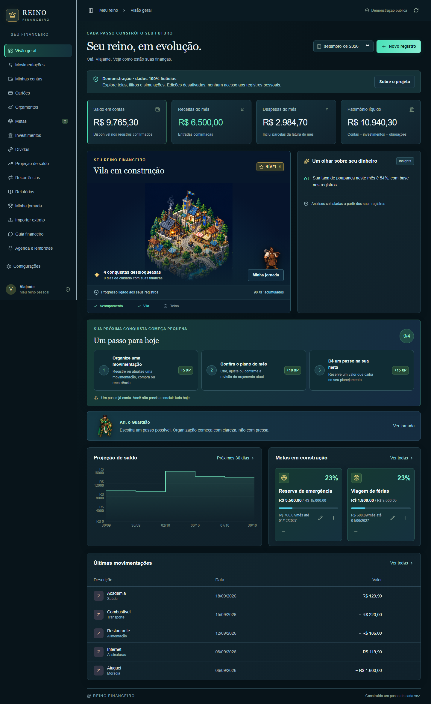
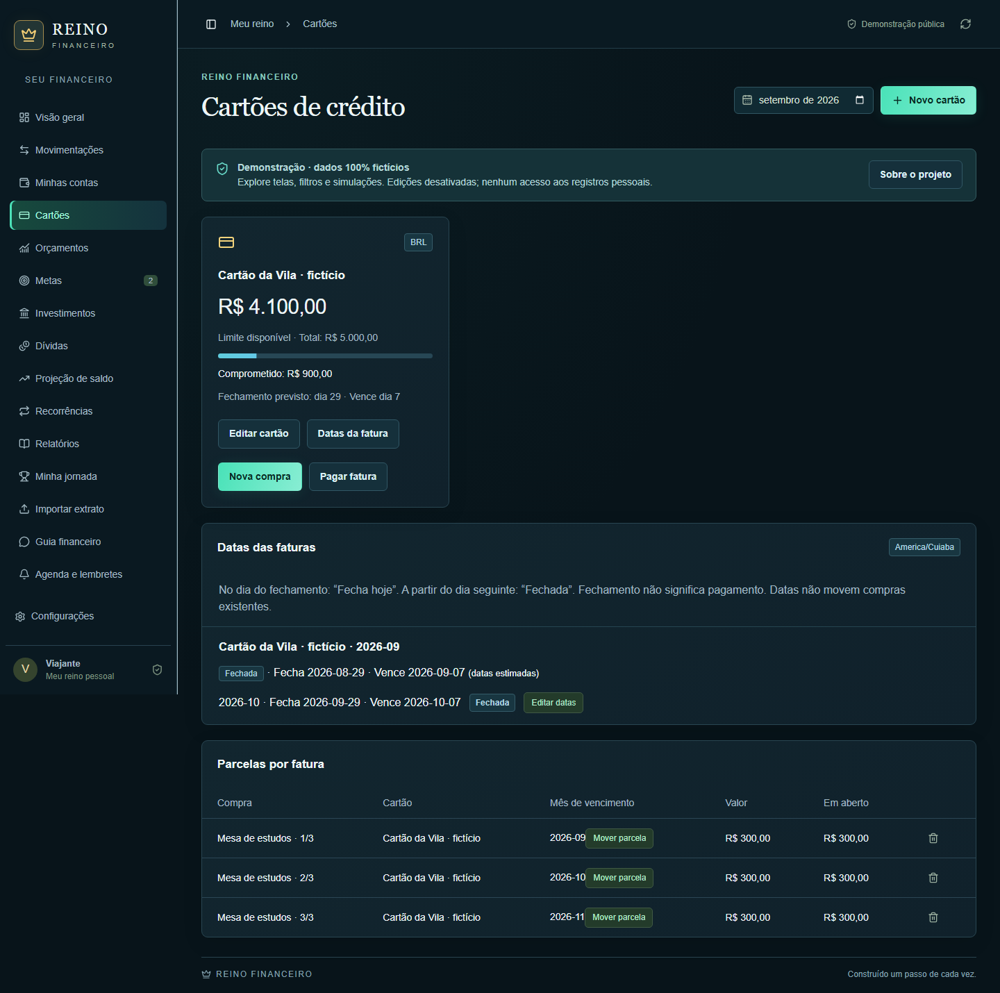
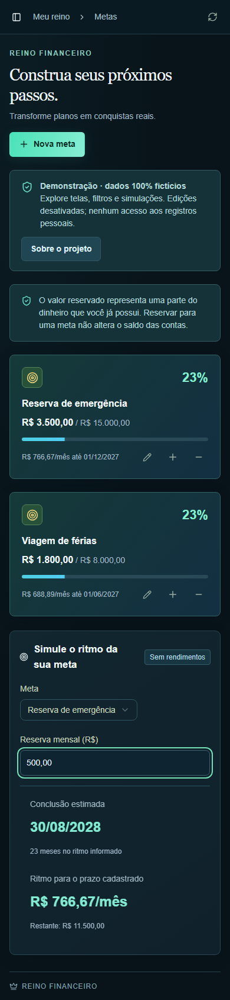
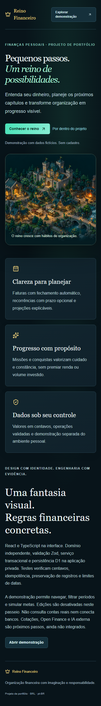

# Reino Financeiro

**Finanças pessoais com clareza, planejamento e um reino que evolui com a organização.**

Projeto de portfólio em React e TypeScript: contas, movimentações, cartões, parcelas, orçamento, metas, recorrências, projeções e missões. XP reconhece hábitos, sem premiar renda ou volume investido.


## Experimente localmente

Node **24** recomendado (mínimo 22.13) e npm.

```sh
npm ci
npm run dev:portfolio
```

Abra **http://127.0.0.1:5174** para a apresentação e **/demo** para explorar o aplicativo. Não precisa de login, credenciais, banco ou serviços externos.

A demonstração usa dados fictícios em memória. Permite navegação, filtros, formulários em modo de visualização e simulação de metas. Não salva operações, não importa extratos e não acessa a API financeira. Recarregar restaura os exemplos. A aplicação privada permanece em / no runtime completo; o servidor de portfólio é separado.

## Recursos

- Saldos em centavos BRL; transferências sem duplicar renda e pagamentos de cartão sem duplicar despesas.
- Faturas **Aberta → Fecha hoje → Fechada**, pelo calendário de America/Cuiaba. Fechamento não significa pagamento; datas reais prevalecem sobre estimativas.
- Recorrências com **data final opcional e inclusiva**, confirmação explícita e preservação do histórico.
- Metas como reservas de dinheiro existente e simulação sem promessa de rendimento.
- Investimentos manuais, orçamento, projeções, importação CSV/OFX no ambiente privado e guia local por regras.
- Jornada persistente e missões com limites de XP, sem revogar recompensas históricas.
- Layout responsivo, foco visível, movimento reduzido e verificações de acessibilidade.



<details><summary>Mais capturas reais</summary>







</details>

Capturas feitas no Chromium com relógio de teste em 30/09/2026 e dados fictícios. Reprodução: `npm run test:browser`.

## Arquitetura

Interface React → contratos Zod → serviço de aplicação → repositório D1. Cálculos ficam no domínio puro. O portfólio estático usa fixtures em memória, sem API ou banco.

| Pasta | Responsabilidade |
| --- | --- |
| domain/ | Dinheiro, datas, projeção, faturas, importação e jornada |
| validations/ | Contratos e limites de entrada |
| services/ | Operações de negócio e fixtures em módulos separados |
| repositories/ | Persistência, concorrência, idempotência e recompensas |
| components/ | Painéis menores, calendário, gráficos e apresentação |
| app/ | Coordenação da interface, rotas e API privada |
| tests/ | Domínio, formulários, D1 efêmero, offline e navegador |

Runtime privado: convenções Next.js via Vinext/Vite, D1, React 19, Tailwind, shadcn, Recharts e Zod. A identidade vem do dispatcher Sites. Não foi adicionado login Google nem ampliado o suporte multiusuário.

## Verificações

```sh
npx playwright install chromium
npm run check
```

Executa lint, TypeScript, domínio/formulários, offline, build privado, integração em D1 descartável, build público, navegador e inspeção do artefato público. No Linux, use `npx playwright install --with-deps chromium`. O workflow [Verify](.github/workflows/verify.yml) usa os mesmos comandos.

Resultados: [Validação](docs/VALIDACAO.md). Problemas comprovados: [Auditoria](docs/AUDITORIA.md).

## Gerar o portfólio público

```sh
npm run build:portfolio
npm run check:public
```

Distribuição em **dist-portfolio/**, sem servidor ou banco. Pronta para a raiz de um domínio estático. GitHub Pages em subdiretório precisa adaptar o caminho-base e links. **O código-fonte está publicado neste repositório. A demonstração pública hospedada ainda está em preparação.** Veja [Publicação](docs/PUBLICACAO.md).

## Uso privado e limites

`npm run dev` abre o runtime completo na porta 5173. Persistência exige binding D1 e migrações; produção exige o dispatcher de identidade confiável. O adaptador local existente oferece identidade de teste somente em loopback. Não use cabeçalhos arbitrários do navegador como autenticação em outro host.

Sem novas migrações, sem alteração das existentes e sem acesso ao banco hospedado. O JSON exportado pela interface não é backup integral e não tem restauração automática. Leia [Segurança](SECURITY.md).

Open Finance, cotações automáticas, IA generativa, push/e-mail, Supabase e apps nativos não estão conectados. O guia é local; PWA não equivale a app publicado nas lojas. Projeções dependem dos registros e não são garantia financeira.

## Documentação

- [Regras e decisões atuais](docs/PORTFOLIO.md)
- [Auditoria e tarefas](docs/AUDITORIA.md)
- [Verificações e evidências](docs/VALIDACAO.md)
- [Publicação](docs/PUBLICACAO.md)
- [Contribuições](CONTRIBUTING.md)
- [Arquitetura histórica e roadmap](docs/ARQUITETURA.md)

Documentos históricos preservam decisões anteriores; PORTFOLIO.md descreve esta versão. Licenças de terceiros permanecem nos arquivos LICENSE correspondentes. Uma licença de distribuição do projeto e das artes ainda deve ser definida pelo titular antes de conceder direitos de reutilização.
